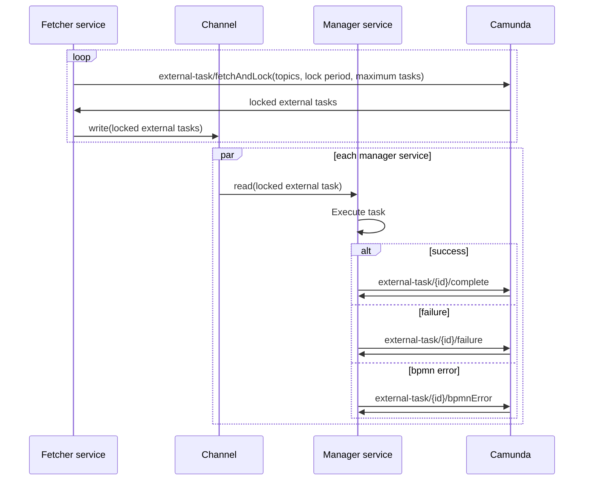

# Haland.CamundaExternalTask


[](https://www.nuget.org/packages/Haland.CamundaExternalTask/)
[](https://www.nuget.org/packages/Haland.CamundaExternalTask/)
[](https://github.com/chrishaland/camunda-external-task/blob/main/LICENSE)
<!-- [](https://snyk.io/test/github/chrishaland/camunda-external-task) | Add when .NET projects are supported https://snyk.io/docs/badges/ -->

This project aims to implement the [Camunda 7 external task pattern](https://docs.camunda.org/manual/latest/user-guide/process-engine/external-tasks/), allowing external applications (in this case, a .NET application) to execute [BPMN activities](https://camunda.com/bpmn/reference/#activities) for Camunda 7 business processes.

The workflow roughly looks like the diagram below. However, note that the lock period is specified per topic, as some tasks may take longer to complete than others.

This framework starts a single `fetcher` service, that fetches external tasks from Camunda. It also starts as many `manager` services as the `MaximumTasks` value specifies (default: 100). Each time the `fetcher` service fetches tasks from Camunda, it asks for a maximum of "number of available `manager` services" tasks. A `manager` serivce is available when it is not executing a task. This way, long running task types does not prevent the framework from fetching new tasks, as long as it has the capacity.



## Getting Started

Add a reference to the Nuget package for your project. Either using the Nuget solution explorer in Visual Studio or using the `dotnet` CLI:

```
dotnet add package Haland.CamundaExternalTask
```

The code example below uses top-level statements (introduced in C# 10) to register a Camunda external task background service with an external task handler.

```
using Haland.CamundaExternalTask;
using Haland.CamundaExternalTask.DependencyInjection;
using Newtonsoft.Json.Linq;
using System.Net.Http.Headers;
using System.Text;

var builder = WebApplication.CreateBuilder(args);

var camunda = builder.Services.AddCamunda(options =>
{
    options.WorkerId = "<worker_id>";
    options.Uri = "http://localhost:8080/engine-rest/";
});

camunda
    .AddExternalTask<SimpleTaskHandler>()
    .ConfigureHttpClient(client =>
    {
        client.DefaultRequestHeaders.Authorization = new AuthenticationHeaderValue("Basic", 
            Convert.ToBase64String(Encoding.UTF8.GetBytes("<username>:<password>")));
    })
;

var app = builder.Build();
app.Run();

public class SimpleTaskHandler : ExternalTaskHandler
{
    public override string Topic => "simpleTask";

    public override async Task<ExternalTaskResult> Execute(ExternalTask externalTask, CancellationToken cancellationToken)
    {
        await Task.CompletedTask;

        return new ExternalTaskCompleteResult(new Dictionary<string, Variable>
        {
            { "simpleTaskResult", Variable.From("success") }
        });
    }
}
```

## Development

Start by downloading and installing [Camunda Platform Run](https://camunda.com/download/) and [Camunda Modeler](https://camunda.com/download/modeler/). Upload the [BPMN](https://www.bpmn.org/) models in `./Samples/Models/` to your instance of `Camunda Platform Run` using `Camunda Modeler`.

The `Samples` project is a sample application for testing the External Task library from this project. It is configured to connect to the default configuration for `Camunda Platform Run`.

Run the application and start a new process instance for the `Pyramids as landing platforms theory` process definition, using the `Camunda Tasklist`. You'll see the application executing the external tasks defined in the process definition.

### Getting started with process instances

Start 100 process instances:

```
$credential = Get-Credential; @(1..100) | %{Invoke-RestMethod -Method Post -Uri "http://localhost:8080/engine-rest/process-definition/key/pyramide_landing_platform_theory/start" -Credential $credential -ContentType "application/json" | Out-Null}
```

Remove all running process instances:

```
$credential = Get-Credential; $(Invoke-RestMethod -Method Get -Uri "http://localhost:8080/engine-rest/process-instance?processDefinitionKey=pyramide_landing_platform_theory" -Credential $credential) | %{Invoke-RestMethod -Method Delete -Uri "http://localhost:8080/engine-rest/process-instance/$($_.id)" -Credential $credential | Out-Null}
```
