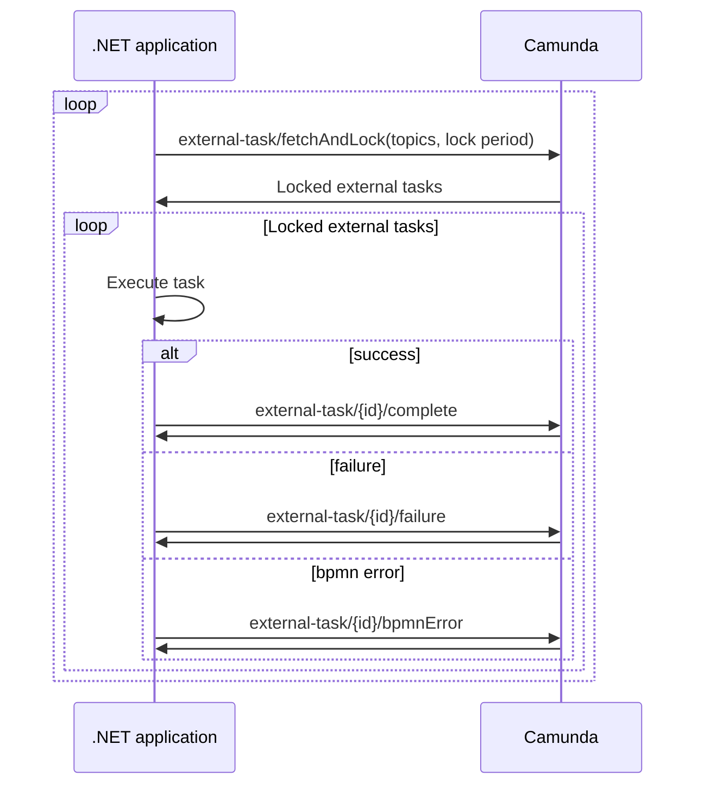

# Haland.CamundaExternalTask

[](https://chrishaland.visualstudio.com/camunda-external-task/_build/latest?definitionId=8&branchName=main)
[](https://chrishaland.visualstudio.com/camunda-external-task/_build/latest?definitionId=8&branchName=main)
[](https://chrishaland.visualstudio.com/camunda-external-task/_build/latest?definitionId=8&branchName=main)
[](https://www.nuget.org/packages/Haland.CamundaExternalTask/)
[](https://www.nuget.org/packages/Haland.CamundaExternalTask/)
[](https://github.com/chrishaland/camunda-external-task/blob/main/LICENSE)
<!-- [](https://snyk.io/test/github/chrishaland/camunda-external-task) | Add when .NET projects are supported https://snyk.io/docs/badges/ -->

This project aims to implement the [Camunda](https://camunda.com/) external task pattern, allowing external applications (in this case, a .NET application) to execute [BPMN activities](https://camunda.com/bpmn/reference/#activities).

The workflow roughly looks like the diagram below. However, note that the lock period is specified per topic, as some tasks may take longer to complete than others.



## Getting Started

Add a reference to the Nuget package for your project. Either using the Nuget solution explorer in Visual Studio or using the `dotnet` CLI:

```
dotnet add package Haland.CamundaExternalTask
```

The code example below uses top-level statements (introduced in C# 10) to register a Camunda external task background service with an external task handler.

```
using Haland.CamundaExternalTask;
using Haland.CamundaExternalTask.DependencyInjection;
using Newtonsoft.Json.Linq;
using System.Net.Http.Headers;
using System.Text;

var builder = WebApplication.CreateBuilder(args);

var camunda = builder.Services.AddCamunda(options =>
{
    options.WorkerId = "<worker_id>";
    options.Uri = "http://localhost:8080/engine-rest/";
});

camunda
    .AddExternalTask<SimpleTaskHandler>()
    .ConfigureHttpClient(client =>
    {
        client.DefaultRequestHeaders.Authorization = new AuthenticationHeaderValue("Basic", 
            Convert.ToBase64String(Encoding.UTF8.GetBytes("<username>:<password>")));
    })
;

var app = builder.Build();
app.Run();

public class SimpleTaskHandler : ExternalTaskHandler
{
    public override string Topic => "simpleTask";

    public override async Task<ExternalTaskResult> Execute(ExternalTask externalTask, CancellationToken cancellationToken)
    {
        await Task.CompletedTask;

        return new ExternalTaskCompleteResult(new Dictionary<string, Variable>
        {
            { "simpleTaskResult", Variable.From("success") }
        });
    }
}
```

You can configure the Camunda HTTP client and message handler from the `ICamundaBuilder`. In the example above, we provide basic authentication for the client. Below follows an example adding a [Polly](https://docs.microsoft.com/en-us/dotnet/architecture/microservices/implement-resilient-applications/implement-http-call-retries-exponential-backoff-polly) HTTP policy for the Camunda HTTP client:

```
dotnet add package Polly
```

```
using Haland.CamundaExternalTask;
using Haland.CamundaExternalTask.DependencyInjection;
using Polly;
using Polly.Extensions.Http;
using System.Net.Http.Headers;
using System.Text;

var builder = WebApplication.CreateBuilder(args);

var camunda = builder.Services.AddCamunda(options =>
{
    options.WorkerId = "<worker_id>";
    options.Uri = "http://localhost:8080/engine-rest/";
});

camunda
    .ConfigureHttpClient(client =>
    {
        client.DefaultRequestHeaders.Authorization = new AuthenticationHeaderValue("Basic", 
            Convert.ToBase64String(Encoding.UTF8.GetBytes("<username>:<password>")));
    })
    .SetHandlerLifetime(TimeSpan.FromSeconds(30)); // Should probably be long enough to handle all retries with the same message handler?
    .AddPolicyHandler(HttpPolicyExtensions
        .HandleTransientHttpError()
        .WaitAndRetryAsync(
            retryCount: 6,
            sleepDurationProvider: retryAttempt => TimeSpan.FromSeconds(Math.Pow(2, retryAttempt))
        ))
;

var app = builder.Build();
app.Run();
```

## Development

Start by downloading and installing [Camunda Platform Run](https://camunda.com/download/) and [Camunda Modeler](https://camunda.com/download/modeler/). Upload the [BPMN](https://www.bpmn.org/) models in `./Tests.IntegrationTests/Models/` to your instance of `Camunda Platform Run` using `Camunda Modeler`.

The `Tests.IntegrationTests` project is an application for testing the External Task library from this project. It is configured to connect to the default configuration for `Camunda Platform Run`.

Run the application and start a new process instance for the `Pyramids as landing platforms theory` process definition, using the `Camunda Tasklist`. You'll see the application executing the external tasks defined in the process definition.